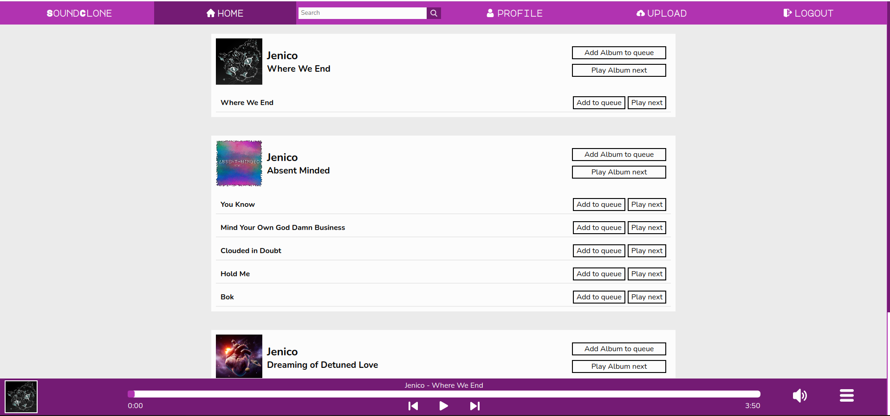

## SOUNCLOUD-CLONE

SoundCloud-clone is an online audio distribution platform and music sharing website that enables its users to upload, promote, and share audio. This app is a Command Shift (formally Manchester Codes) projects which aims to replicate some functionalities of the largest music streaming services in the world.

## Table of Contents

1. [Features](#features)
2. [Dependencies](#dependencies)
3. [Setup](#setup)
4. [Commands](#commands)
5. [Attribution](#attribution)

## Features

- Built in music player:
  - Add songs to a playlist.
  - Songs in the playlist can be removed or skipped to.
  - Play/Pause button.
  - Skip to next or previous song buttons.
  - Volume slider.
  - Interactable progress bar - allowing for selecting playback time.
  - Shows Artist name, Song Name and Album cover art.
- Can find other artists albums in the home feed, or use the search bar to find other Artists, Albums or Songs by name.
- Artists have a profile page containing all albums uploaded by the artist.
- Login or Signup to upload your own Albums.
- Edit profile allows you to change your username, email or password, or delete your account and all user data.
- Edit Album allows you to update the album name or cover art, as well as editing each song in the album (name and audio), delete songs from the album or add new songs to the album.
- Interacts with the [Backend API](https://github.com/PerryBaran/soundcloud-clone-api) hosted on render to get artist, album and song information. Images and audio files stored in an AWS S3 Bucket.

## Preview

Live preview currently unavailable due to running out of the free trial of AWS




## Dependencies

- [react](https://reactjs.org/)
- [axios](https://www.npmjs.com/package/axios)
- [proptypes](https://www.npmjs.com/package/prop-types)
- [react-router-dom](https://www.npmjs.com/package/react-router-dom)
- [js-cookie](https://www.npmjs.com/package/js-cookie)
- [jwt-decode](https://www.npmjs.com/package/jwt-decode)
- [uuid](https://www.npmjs.com/package/uuid)
- [react-spinners](https://www.npmjs.com/package/react-spinners)

**Dev Dependancies**

- [prettier](https://www.npmjs.com/package/prettier)
- [eslint](https://www.npmjs.com/package/eslint)
- [gh-pages](https://www.npmjs.com/package/gh-pages)

## Setup

**Install Dependancies**

1.  Clone the repo to a local file.

```
$ git clone https://github.com/ngiannotta84/soundcloud-clone.git
```

2.  Install all dependancies.

```
$ npm i
```

## Commands

```
$ npm start
```

Runs the app in the development mode.  
Open [http://localhost:3000](http://localhost:3000/) to view it in the browser.
The page will reload if you make edits.  
You will also see any lint errors in the console.

```
$ npm test
```

Launches the test runner in the interactive watch mode.  
See the section about [running tests](https://facebook.github.io/create-react-app/docs/running-tests) for more information.

```
$ npm build
```

Builds the app for production to the `build` folder.  
It correctly bundles React in production mode and optimizes the build for the best performance.

```
$ npm run prettier
```

runs prettier on all files to formal code.

```
$ npm run predeploy
```

helps to bundle the react app. This command is run automatically when running deploy.

```
$ npm run deploy
```

Generates a production build of the app and deploys it to GitHub pages.

## Attribution

Created by **Nicola Giannotta** and **Perry Baran**.

Icons by [flaticon](https://www.flaticon.com/)
